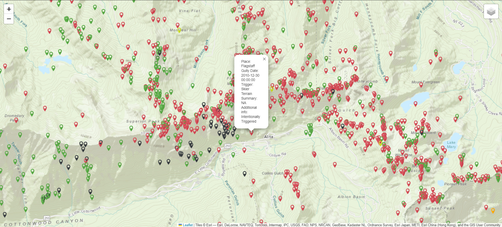

# slcavi

Exploration of avalanches in the Wasatch mountains using historical avalanche and climate data.

---
## Table of Contents

- [About](#about)
- [Getting Started](#getting-started)
- [Usage](#usage)
- [Liscense](#liscense)

---
## About <a name="about"></a>

This project is focused on providing information about avalanches in the Wasatch range. The main feature of this respository is an interactive map displaying avalanche incidents and additional information about the event.



---
## Getting Started <a name="getting-started"></a>

Download this repository using the following commands:
```bash
$ git clone https://github.com/chalberg/slcavi.git
$ cd slcavi
$ pip install -r requirements.txt
```

---
## Usage <a name="usage"></a>

#### Launching the App

The main feature of this repository is a web app which displays an interactive map of avalanche incidents in the Wasatch mountains. To launch the app, ensure you have all the requirements installed and run the following commands:
```bash
$ cd slcavi
$ python app.py
```
This will launch the app and generate some text, including the following link:
```
* Running on http://127.0.0.1:5000
```
Paste this link into your brower to access the app.

#### Generating the Map

To generate the interactive map pictured above, navigate to this directory and run the following command:
```bash
$ python visualizations.py --save
```

#### Downloading Data
The data required to run all the functionality is included in this repository. However, if you want to get the most up to date data you will need to take additional steps.

__Avalanche Forecasts__ 
Run the following commands to get up to date records. Records should be available up to the present day (season dependent). The whole process should take around 25 minutes.
```bash
$ cd slcavi
$ python load_data.py --get_uac_data
```

__Avalanche Records__
- Go to this [Utah Avalanche Center](https://utahavalanchecenter.org/avalanches/salt-lake) page
- Select the "Salt Lake" region
- Click "Download." This should take you to a new page and begin an export process.
- The csv file will be automatically downloaded when the export process is finished. Rename the file "avalanches.csv" and move it to the "data" folder in this project (replace the existing file).

__NOAA Climate Data__
- Go to the [Climate Data Online](https://www.ncei.noaa.gov/cdo-web/search) page
- For the Date Range, begin at 2016-08-01 and end at the present day.
- Search for each of the station codes below, and select the "Add to Cart" button for each.
    - USC00420072 (Alta)
    - US1UTSL0025 (Cottonwood Heights 1.6 SE)
    - USC00427846 (Silver Lake Brighton)
    - USS0011J42S (Snowbird)
    - USS0011J57S (Brighton)
- Once all stations are added to the cart, click on the cart icon.
- In the cart options, select "Custom GHCN-Daily CSV" for the output format, and ensure the date range is 2016-08-01 to [present day].
- Continue to the next page.
    - Under station details, select "Station name" and "Geographic Location"
    - Under data types, select "Water" "Precipitation" and "Air Temperature"
- Enter your email and submit the order. Once you recieve the file in an email, download the file, rename it "noaa_wasatch_daily.csv" and move it to the "data" folder in this repository.

---
## Liscense <a name="liscense"></a>

MIT License

Copyright (c) [2024] [Charlie Halberg]

Permission is hereby granted, free of charge, to any person obtaining a copy of this software and associated documentation files (the "Software"), to deal in the Software without restriction, including without limitation the rights to use, copy, modify, merge, publish, distribute, sublicense, and/or sell copies of the Software, and to permit persons to whom the Software is furnished to do so, subject to the following conditions:

The above copyright notice and this permission notice shall be included in all copies or substantial portions of the Software.

THE SOFTWARE IS PROVIDED "AS IS", WITHOUT WARRANTY OF ANY KIND, EXPRESS OR IMPLIED, INCLUDING BUT NOT LIMITED TO THE WARRANTIES OF MERCHANTABILITY,FITNESS FOR A PARTICULAR PURPOSE AND NONINFRINGEMENT. IN NO EVENT SHALL THE AUTHORS OR COPYRIGHT HOLDERS BE LIABLE FOR ANY CLAIM, DAMAGES OR OTHER LIABILITY, WHETHER IN AN ACTION OF CONTRACT, TORT OR OTHERWISE, ARISING FROM, OUT OF OR IN CONNECTION WITH THE SOFTWARE OR THE USE OR OTHER DEALINGS IN THE
SOFTWARE.