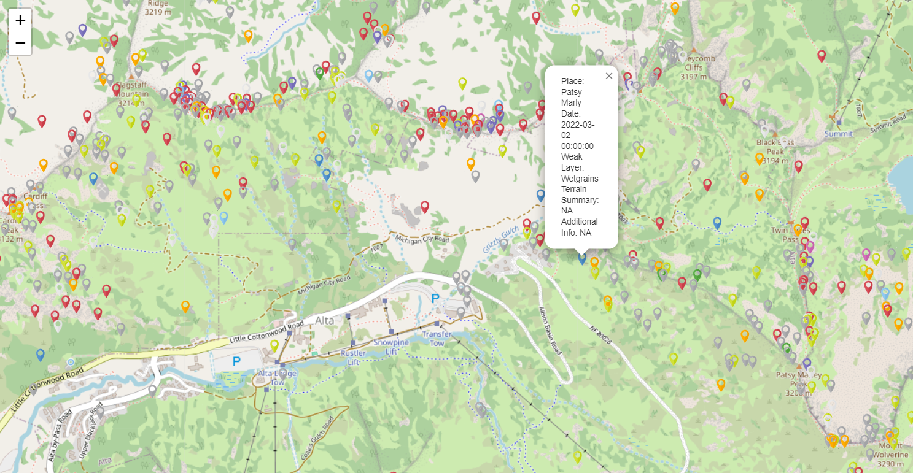
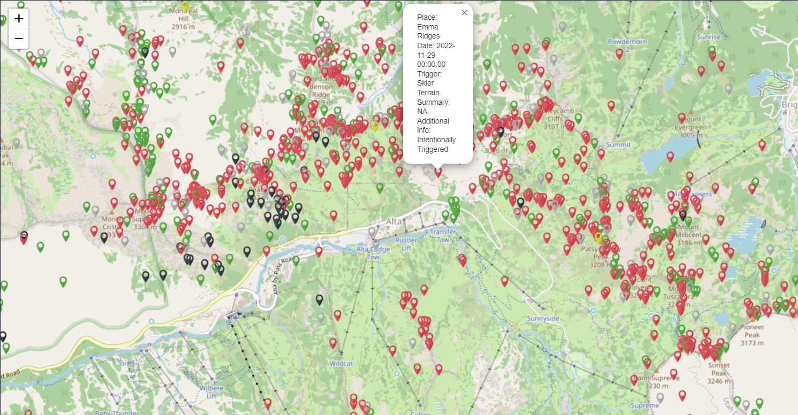

# slcavi

Exploration of avalanches in the Wasatch mountains using historical avalanche and climate data.

## Table of Contents

- [About](#about)
- [Getting Started](#getting-started)
- [Usage](#usage)
- [Contributing](#contributing)
- [Liscense](#liscense)

## About <a name="about"></a>

This project is focused on providing information about avalanches in the Wasatch range. So far, I have created an interactive disply which can be accessed here.

[Interactive Map with weak layer info](assets/maps/avi_map_layer.html)


[Interactive Map with avalanche trigger info](assets/maps/avi_map_trigger.html)


## Getting Started <a name="getting-started"></a>

Download this repository using the following commands:

```bash
$ git clone https://github.com/chalberg/slcavi.git
$ cd slcavi
$ pip install -r requirements.txt
```

## Usage <a name="usage"></a>


## Contributing <a name="contributing"></a>


## Liscense <a name="liscense"></a>

MIT License

Copyright (c) [2024] [Charlie Halberg]

Permission is hereby granted, free of charge, to any person obtaining a copy of this software and associated documentation files (the "Software"), to deal in the Software without restriction, including without limitation the rights to use, copy, modify, merge, publish, distribute, sublicense, and/or sell copies of the Software, and to permit persons to whom the Software is furnished to do so, subject to the following conditions:

The above copyright notice and this permission notice shall be included in all copies or substantial portions of the Software.

THE SOFTWARE IS PROVIDED "AS IS", WITHOUT WARRANTY OF ANY KIND, EXPRESS OR IMPLIED, INCLUDING BUT NOT LIMITED TO THE WARRANTIES OF MERCHANTABILITY,FITNESS FOR A PARTICULAR PURPOSE AND NONINFRINGEMENT. IN NO EVENT SHALL THE AUTHORS OR COPYRIGHT HOLDERS BE LIABLE FOR ANY CLAIM, DAMAGES OR OTHER LIABILITY, WHETHER IN AN ACTION OF CONTRACT, TORT OR OTHERWISE, ARISING FROM, OUT OF OR IN CONNECTION WITH THE SOFTWARE OR THE USE OR OTHER DEALINGS IN THE
SOFTWARE.